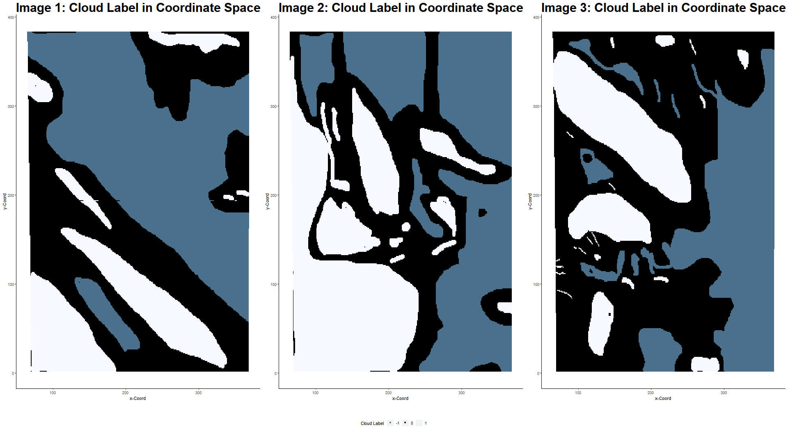

# Stat154-Project2

Repo for Spring 2019 Stat 154 Project 2
+ Catherine Wang- catherine_wang at berkeley.edu
+ Yijin Wang



## Final Report: 

The Final Report pdf is the final submission for this project. (This pdf was generated on google docs, and the corresponding word file is also included for reproducibility.)

## Reproducibility:
To reproduce all the figures, graphs, tables, and results from the final report, run through the R code in the `project2_123a.R`, `project2_3b.R`, `project2_4.R` file in order. (Also make sure that you all the raw image data in a folder `image_data/` that can be found from either this repository or from MISR. Make sure you have installed the required libraries such as `ggplot2`, `dplyr`, `gridExtra`, `GGally`, `caret`, `MASS`, `e1071` etc.)


+ note: in the script, it saves the images in between in the `imgs` folder, however these may result in lower quality (resolution) images than the actual final report contains. To get the higher quality images, run the code and zoom in in RStudio. 
+ note: word compresses the images when converting to pdf, so to view a better resolution, look at the word document, look in the `imgs/` folder, or run in R. 
+ note: splitting the data into training and testing takes a while to run. To quicken the process, this data has been saved in `data/*.csv`. In R, simply load the data by `read.csv("data/*.csv")`. To read in the data easily, follow the code shown below:

```
method1_train = read.csv("data/train.csv")
method1_train = method1_train[(method1_train$expert_label) != 0, ]
method1_val = read.csv("data/validation.csv")
method1_val = method1_val[(method1_val$expert_label) != 0, ]
method1_test = read.csv("data/test.csv")
method1_test = method1_test[(method1_test$expert_label) != 0, ]

method2_train = rbind(read.csv("data/train2.csv"), read.csv("data/train3.csv"))
method2_train = method2_train[(method2_train$expert_label != 0), ]
method2_val = rbind(read.csv("data/validation2.csv"), read.csv("data/validation3.csv"))
metho2_val = method2_val[(method2_val$expert_label != 0), ]
method2_test = read.csv("data/image1.csv")
method2_test = method2_test[(method2_test$expert_label != 0), ]
```

